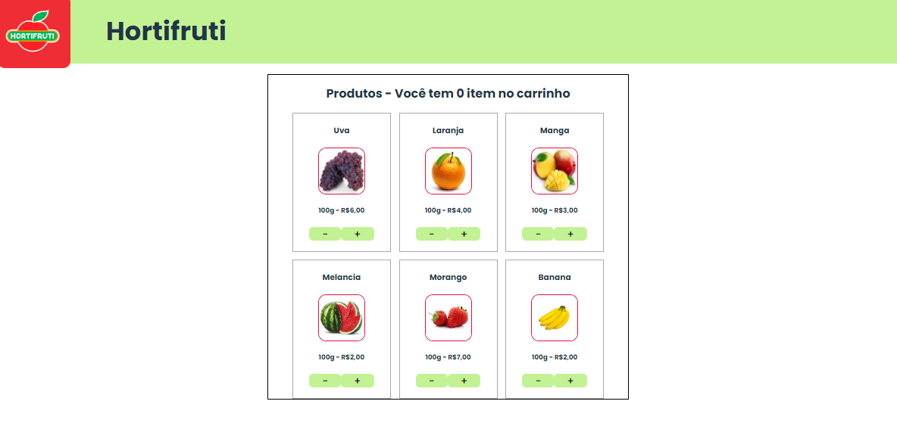
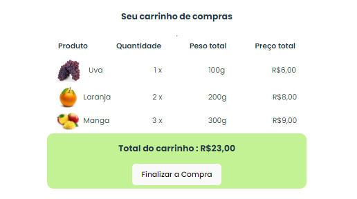

# Hortifruit Project 🍎🍌

## The Hortifruit Application



## The shopping cart



## 💡 **Description:**

The "Hortifruit" project is an academic endeavor aimed at creating a digital representation of a local fruit and vegetable store in my neighborhood. In Portuguese, "hortifruit" refers to stores specializing in fresh fruits and vegetables. This project was developed to showcase how such a store might look and function online.

## 🎯 **Purpose:**

This project serves as a practical exercise in web development, allowing me to apply my skills in creating a web application for a local business. It demonstrates basic e-commerce/cart functionality and serves as a portfolio piece.

## 🛠️ **Technologies Used:**

- **React.js**: For building the user interface.
- **TypeScript**: For type safety and improved development experience.
- **Vite**: For fast development and build process.

## 🚀 **How to Run the Project:**

1. Clone the repository:
   ```bash
   git clone https://github.com/LadyJessie19/HortifruitEcommerce.git
   ```
2. Navigate to the project directory:
   ```bash
   cd hortifruit
   ```
3. Install dependencies:
   ```bash
   npm install
   ```
4. Start the development server:
   ```bash
   npm run dev
   ```

## 🤝 **Contributions:**

Feel free to contribute to this project by opening a pull request with improvements, bug fixes, or additional features. Your contributions are welcome and appreciated!

## 🙋‍♀️ **Author:**

[Jessie M. Bentes](https://github.com/LadyJessie19)

## 📧 **Contact:**

If you have any questions or feedback, don't hesitate to reach out to me. I'm here to help and would love to hear from you!

Hope you find this project interesting and useful! 🚀
